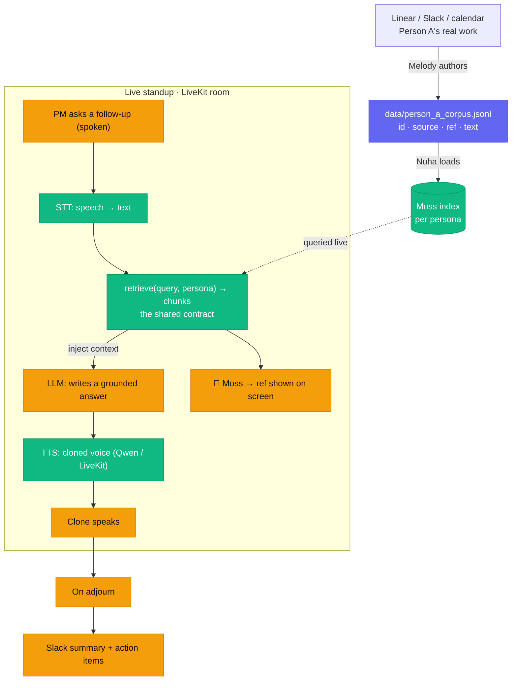

# Standup Proxy

When a teammate misses standup, their **AI clone** joins in their cloned voice and answers questions about their work — grounded in their real context (Linear / Slack) pulled live from **Moss** — then posts a Slack summary.

Built at the Moss Conversational AI Hackathon. **Python + LiveKit.**

## Who's building what

| Person | Owns |
|--------|------|
| **Melody** | Person A's context → a corpus file |
| **Nuha** | Moss retrieval + voice cloning |
| **Tony** | the LiveKit agent + room + Slack summary |

Full briefs are in **`prds/`** (start with `prds/README.md`). Your paste-into-your-agent kickoff is in **`prds/handoffs/`**.

## How it works



**Owners:** 🟣 Melody (content) · 🟢 Nuha (Moss retrieval + voice) · 🟠 Tony (LiveKit agent + room + Slack). The moat is `retrieve()` pulling the **right real chunk** live, shown on screen *and* spoken.

## Get started

The brain runs on the standard library — no keys needed to test the text path:

```bash
python3 scripts/harness.py "what's blocking the auth migration?"   # see retrieval (uses the stub)
python3 -m pytest tests/ -q                                        # contract + moat test
```

For the real build: `pip install -r requirements.txt`, then `cp .env.example .env` and fill in keys. Read your PRD in `prds/`.

## Working together

Read **`CLAUDE.md`**. Before you code: `git pull`, claim your task in `agent-status/<you>.json`, and only touch your own lane's files.

**Status dashboard:** serve from the repo root and open `/docs/`:

```bash
python3 -m http.server
# then open http://localhost:8000/docs/
```
