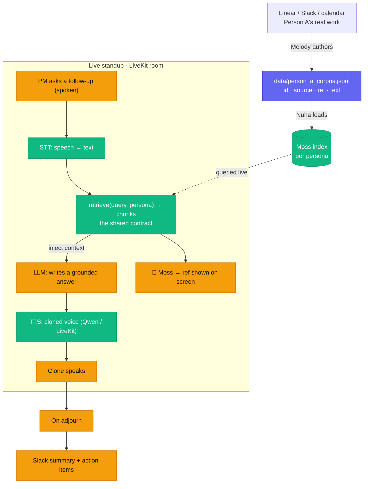

# Standup Proxy

When a teammate misses standup, their **AI clone** joins in their cloned voice and answers questions about their work — grounded in their real context (Linear / Slack) pulled live from **Moss** — then posts a Slack summary.

Built at the Moss Conversational AI Hackathon. **Python + LiveKit.**

## Who's building what

| Person | Owns |
|--------|------|
| **Melody** | Person A's context → a corpus file |
| **Nuha** | Moss retrieval + voice cloning |
| **Tony** | the LiveKit agent + room + Slack summary |

Full briefs are in **`prds/`** (start with `prds/README.md`). Your paste-into-your-agent kickoff is in **`prds/handoffs/`**.

## How it works



**Owners:** 🟣 Melody (content) · 🟢 Nuha (Moss retrieval + voice) · 🟠 Tony (LiveKit agent + room + Slack). The moat is `retrieve()` pulling the **right real chunk** live, shown on screen *and* spoken.

## Run the demo

The live agent (`agent-py/`) and the on-screen 🔎 trace panel (`frontend/`) are built on the official LiveKit + Moss starter. Two sets of credentials: **LiveKit** in `agent-py/.env.local` and **Moss** in `.env`.

```bash
# 1. Build the persona's Moss index from the corpus (once, or whenever the corpus changes)
uv run --project agent-py python -m brain.ingest

# 2. Run the agent + frontend together
pnpm dev      # then open http://localhost:3000 → "Start call" → allow the mic
```

In the call, ask **"What's the status of the auth migration?"**, then **"What's actually blocking it?"** — the clone answers in its cloned voice while the retrieved Moss chunks light up on screen (ref · source · relevance).

**Quick checks** (no room/voice — just the retrieval seam + tests):

```bash
uv run --project agent-py python scripts/harness.py "what's blocking the auth migration?"
uv --directory agent-py run pytest -q     # grounding + integration tests (12)
```

New here? Read your PRD in `prds/` (live-agent detail in `prds/04-LIVE-AGENT-*.md`).

## Working together

Read **`CLAUDE.md`**. Before you code: `git pull`, claim your task in `agent-status/<you>.json`, and only touch your own lane's files.

**Status dashboard:** serve from the repo root and open `/docs/`:

```bash
python3 -m http.server
# then open http://localhost:8000/docs/
```
