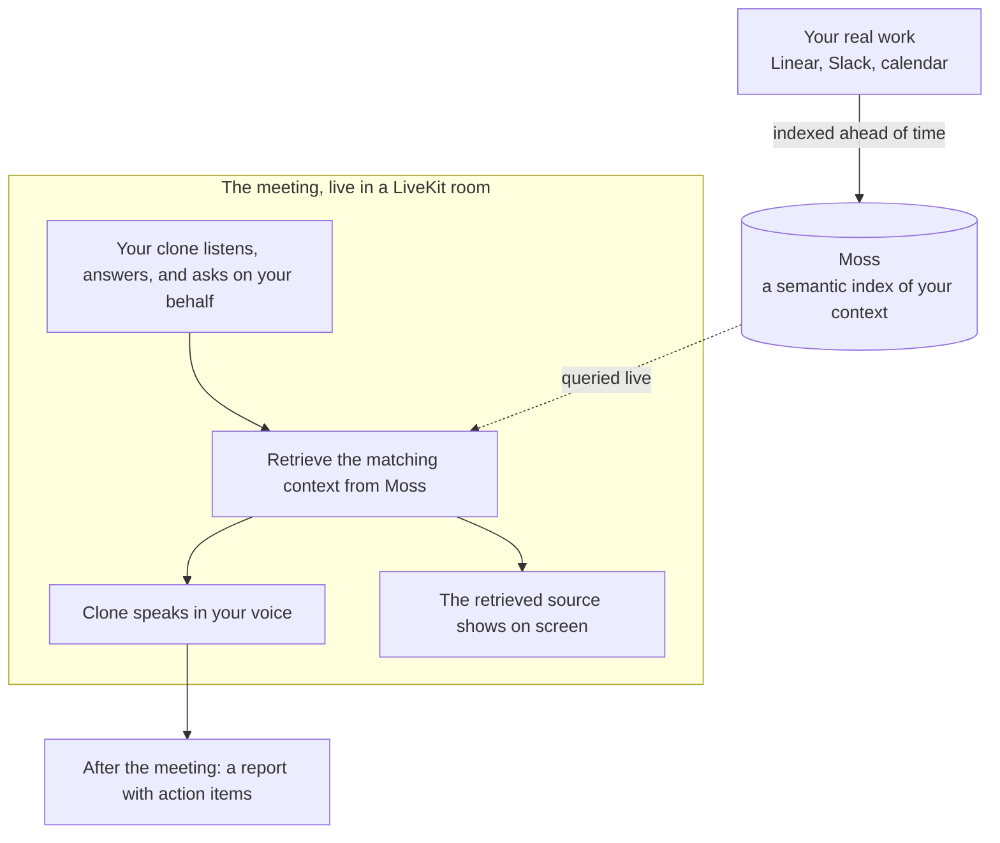

# Standup Proxy

**When you can't make a meeting, send your clone.** Standup Proxy is a personalized AI clone that joins meetings on your behalf and represents you, as you. It knows what you are working on, gives your update in your own cloned voice, answers the team's questions about your work, and asks the questions you would ask, so you can skip the meeting without falling out of the loop.

Built at the Moss Conversational AI Hackathon. Python, LiveKit, and Moss.

## The problem

A lot of meetings don't need all of you, just the part of you that knows your work. But skipping has a cost: the team loses ten minutes guessing where your work stands, decisions stall on a status nobody has, and you spend the next morning re-answering the same questions in Slack. Today the only options are attend and lose the time, or skip and lose the context.

## What it does

Standup Proxy gives you a third option: send a clone that is actually you.

- **Knows your work.** It is grounded in your real context, your Linear tickets, Slack threads, and calendar, so it can speak to what you are actually doing.
- **Joins as you, in your voice.** It appears in the meeting as a participant and speaks in your cloned voice.
- **Gives your update and answers for you.** It delivers your standup and fields follow-up questions about your work the way you would.
- **Asks on your behalf.** It is an agent, not a recorder, so it can also ask the questions you would ask to get the information you need out of the meeting.
- **Brings it back.** After the meeting it reports what happened, with action items.

## What makes it different

It is not a note-taker. Note-takers transcribe and summarize a meeting after the fact; they don't know you, and they don't act for you. Standup Proxy is a clone of you: it knows what you are working on, it represents you in the room, and it is agentic, it both answers and asks on your behalf.

Think of it as your assistant. You are the boss, you hand off the meeting, and your clone goes, participates as you, and comes back with what matters. The point is not notes after the fact. The point is being present, as yourself, without being there.

And it stays honest: every answer is built from context retrieved live from your real work, and you can see the exact source on screen as the clone speaks, so the team can trust that it is really you talking, not a generic model guessing.

## How it works



## Built on

- **LiveKit** runs the real-time meeting: the room, turn-taking, speech-to-text, and your clone joining as a participant.
- **Moss** indexes your work context and does the live semantic search that lets the clone speak to what you are actually doing.
- **Voice cloning** lets your clone speak in your own voice.

## Run the demo

Two sets of credentials: LiveKit (in `agent-py/.env.local`) and Moss (in `.env`).

```bash
# 1. Index your work context into Moss (once, or whenever it changes)
uv run --project agent-py python -m brain.ingest

# 2. Run the agent and the web app together
pnpm dev      # open http://localhost:3000, click "Join standup", allow the mic
```

In the meeting, ask "What's the status of the auth migration?", then "What's actually blocking it?". The clone answers in the cloned voice while the context it used appears on screen.

Text-only check, no room or voice:

```bash
uv run --project agent-py python scripts/harness.py "what's blocking the auth migration?"
```
