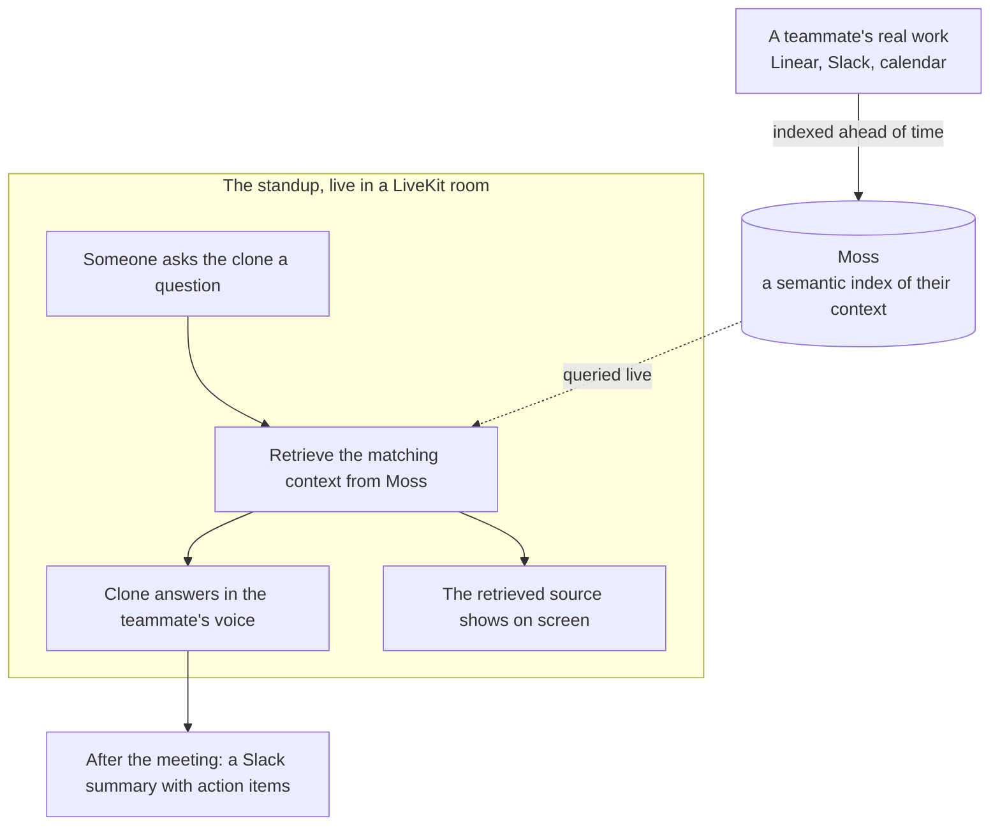

# Standup Proxy

**When a teammate can't make standup, their AI clone shows up instead.** It joins the call in their cloned voice, gives their update, and answers the team's follow-up questions about their work. Every answer is grounded in that person's real context (Linear, Slack, calendar) retrieved live, with the exact source shown on screen as the clone speaks.

Built at the Moss Conversational AI Hackathon. Python, LiveKit, and Moss.

## The problem

Standups break when someone is out. The team loses ten minutes guessing where their work stands, decisions stall waiting on a status nobody has, and the absent person spends the next morning re-answering the same questions in Slack.

## What it does

The missing teammate's clone is a real participant in the meeting:

- **Joins in their cloned voice** and delivers their standup update.
- **Answers live follow-ups** the way the person would, for example "what's the status of the auth migration?" and "what's actually blocking it?"
- **Grounded in their real work, not guesses.** Every answer is built from context retrieved live from a Moss index of that person's Linear tickets, Slack threads, and calendar.
- **Shows its work.** The retrieved source appears on screen at the moment the clone speaks it, so you can see where the answer came from.
- **Leaves a trail.** After the meeting it posts a summary with action items to Slack.

## Why it is more than a chatbot

The hard part, and the thing you can watch happen on screen, is that the clone says the right *real* specifics: "Ivan flagged sliding-window refresh-token rotation, tracked as ENG-419, and it is blocking the prod rollout." A detail like that can't be invented by a generic model. It has to be retrieved from the person's actual context. We show that retrieved chunk on screen as the clone speaks, so the grounding is visible, not just claimed.

## How it works



## Built on

- **LiveKit** runs the real-time meeting: the room, turn-taking, speech-to-text, and the clone joining as a participant.
- **Moss** does the semantic search over each person's indexed work context. This live retrieval is what makes the answers real.
- **Voice cloning** lets the update and the answers be spoken in the teammate's own voice.

## Run the demo

Two sets of credentials: LiveKit (in `agent-py/.env.local`) and Moss (in `.env`).

```bash
# 1. Index a teammate's work context into Moss (once, or whenever it changes)
uv run --project agent-py python -m brain.ingest

# 2. Run the agent and the web app together
pnpm dev      # open http://localhost:3000, click "Start call", allow the mic
```

In the call, ask "What's the status of the auth migration?", then "What's actually blocking it?". The clone answers in the cloned voice while the retrieved context appears on screen.

Text-only check, no room or voice:

```bash
uv run --project agent-py python scripts/harness.py "what's blocking the auth migration?"
```
