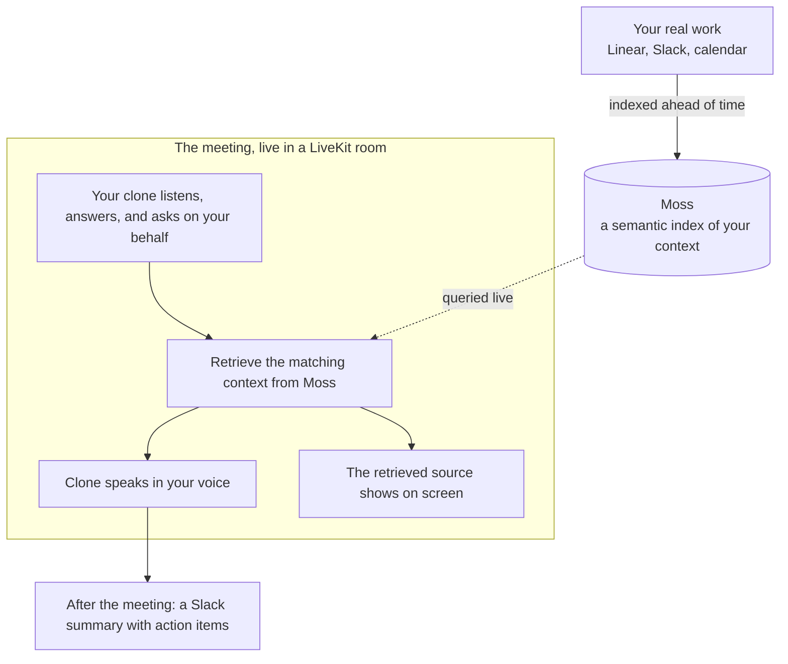

# Hippo

**When you can't make a meeting, send your clone.** Hippo is a personalized AI clone that joins meetings on your behalf and represents you, as you. It knows what you are working on, gives your update in your own cloned voice, answers the team's questions about your work, and asks the questions you would ask, so you can skip the meeting without falling out of the loop.

Built at the Moss Conversational AI Hackathon. Python, LiveKit, and Moss.

## The problem

A lot of meetings don't need all of you, just the part of you that knows your work. But skipping has a cost: the team loses ten minutes guessing where your work stands, decisions stall on a status nobody has, and you spend the next morning re-answering the same questions in Slack. Today the only options are attend and lose the time, or skip and lose the context.

## What it does

Hippo gives you a third option: send a clone that is actually you.

- **Knows your work.** It is grounded in your real context (Linear tickets, Slack threads, calendar), so it can speak to what you are actually doing.
- **Joins as you, in your voice.** It appears in the meeting as a participant and speaks in your cloned voice.
- **Gives your update and answers for you.** It delivers your standup and fields follow-up questions about your work the way you would.
- **Asks on your behalf.** It is an agent, not a recorder, so it can also ask the questions you would ask.
- **Brings it back.** After the meeting it posts a summary to Slack, with action items.

## What makes Hippo different

Hippo is not a note-taker. Note-takers transcribe and summarize a meeting after the fact; they don't know you, and they don't act for you. Hippo is a clone of you: it knows what you are working on, it represents you in the room, and it is agentic -- it both answers and asks on your behalf.

And Hippo stays honest: every answer is built from context retrieved live from your real work, and the exact source shows on screen as the clone speaks -- so the team can trust that it is really you talking, not a generic model guessing.

## How it works



## Repo map

| Path | What lives here |
|------|-----------------|
| `agent-py/` | The LiveKit agent (Python) -- the demo runs here. Entry point: `src/agent.py`. |
| `frontend/` | The meeting-room web app (Next.js) -- people join, the clone shows as a participant, the retrieved context docks on the side. |
| `brain/` | The Moss seam: `retrieve()` (query) and `ingest.py` (load the corpus into Moss). |
| `data/` | The persona's corpus -- `person_a_corpus.jsonl`, one record per line. |
| `personas.py` | Who the clone is: display name, voice id, which Moss index to search. |
| `voice/` | Voice-clone enrollment and the pre-rendered demo audio. |
| `docs/demo-script.md` | The exact 2-minute demo: the questions and the expected on-screen retrieval. |

## Run it yourself

The whole demo runs locally. The only thing you cannot get from this repo is the secrets -- they are gitignored. For the hackathon demo, **ask Tony for the filled-in `.env`**; otherwise provision your own from the providers linked in `.env.example`.

### Prerequisites

- **Node.js >= 22** and **pnpm >= 10** (`npm install -g pnpm`)
- **uv** (Python package manager) -- `curl -LsSf https://astral.sh/uv/install.sh | sh`
- The keys listed in `.env.example` (LiveKit, Moss, DashScope, Slack)

### 1. Install

```bash
pnpm install              # root tooling (the concurrent dev runner)
pnpm install:frontend     # web app dependencies
pnpm install:agent-py     # agent dependencies (uv sync)
```

### 2. Configure (one .env)

There is a single config file: the repo-root `.env`. Both the Python agent and the web app read it -- you do **not** need any per-folder `.env.local`.

```bash
cp .env.example .env      # then fill it in (or paste the values Tony shares)
```

What each key is for:

| Key | Used for |
|-----|----------|
| `LIVEKIT_URL`, `LIVEKIT_API_KEY`, `LIVEKIT_API_SECRET` | The room, the agent worker, and STT/LLM/TTS via LiveKit Inference |
| `AGENT_NAME=agent-py` | Lets the web app dispatch the clone into the room (leave as-is) |
| `MOSS_PROJECT_ID`, `MOSS_PROJECT_KEY` | Live semantic retrieval of the persona's context |
| `DASHSCOPE_API_KEY` | The Qwen voice clone (the clone's spoken voice) |
| `SLACK_WEBHOOK_URL` | The channel the post-standup summary is posted to |

### 3. Index the context into Moss

Load the persona's corpus into Moss once (and again whenever the corpus changes). Run this from the repo root:

```bash
uv run --project agent-py python -m brain.ingest
```

Note: this is the indexer for this project. (Ignore `pnpm moss:index` -- that builds the unrelated starter `knowledge` index and is not used here.)

### 4. Run the demo

First run only, download the agent's local models (voice activity detection + turn detector):

```bash
pnpm agent:py:download-files
```

Then start the agent and the web app together:

```bash
pnpm dev
```

Open **http://localhost:3000**, click **Join standup**, and allow the microphone. The clone (a "Nuha" tile) joins the room. Ask:

1. **"What's the status of the auth migration?"**
2. **"What's actually blocking it?"**

The clone answers in the cloned voice while the Moss context it used appears on screen. Off-script questions are answered live, also in the cloned voice. When the meeting ends, a summary is posted to the Slack channel. The full script and the expected on-screen retrieval are in `docs/demo-script.md`.

## Test it without a mic

You can exercise the core paths with no room and no audio:

```bash
# Retrieval only -- prints the Moss trace for any question (proves your Moss keys work):
uv run --project agent-py python scripts/harness.py "what's blocking the auth migration?"

# The behavioral test suite (routing, grounding, summary, voice path):
pnpm test
```

## Troubleshooting

| Symptom | Fix |
|---------|-----|
| On-screen retrieval is empty / nothing found | Run step 3 (`brain.ingest`); confirm `MOSS_PROJECT_ID` / `MOSS_PROJECT_KEY` are in `.env`. |
| Clone speaks in a generic voice, not the cloned one | `DASHSCOPE_API_KEY` is missing or wrong in `.env`. |
| The clone never joins the room | Make sure the `agent-py` pane in `pnpm dev` is running with no errors, and that `AGENT_NAME=agent-py` is in `.env`. |
| No Slack summary after the meeting | Set `SLACK_WEBHOOK_URL` in `.env`. (Sessions where no human ever spoke are skipped on purpose.) |
| `localhost:3000` already in use | Stop the other process, or run the web app on another port: `pnpm --dir frontend dev -- -p 3001`. |

## Built on

- **LiveKit** runs the real-time meeting: the room, turn-taking, speech-to-text, and the clone joining as a participant.
- **Moss** indexes the work context and does the live semantic search that lets the clone speak to what you are actually doing.
- **Qwen voice clone** (via DashScope) lets the clone speak in the person's own voice.

## Extending it

Each person owns one lane behind a fixed interface (corpus file, `retrieve()`, voice config) so the lanes stay decoupled. See `CLAUDE.md` for the team workflow and `prds/` for the per-lane briefs.
